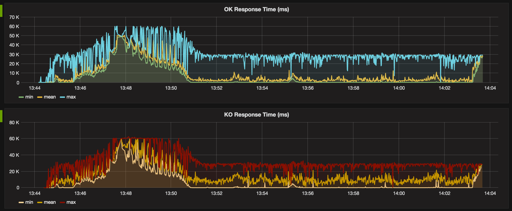

# gatling-docker
Run Gatling over Docker with InfluxDB and Grafana
[https://jhipster.github.io](https://jhipster.github.io)

### pre-reqs
To run this demo you need:
- [docker](https://www.docker.com/)
- docker-machine
- docker-compose

### How to run
From root directory execute the following:

```
eval $(docker-machine env default)
docker-compose up -d
```

Check your docker-machine ip `docker-machine ip default` which usually is 192.168.99.100
After a few seconds access Grafana site at http://192.168.99.100:3000/dashboard/db/sample-service
or replace the ip with the correct one.

You should be presented with a screen that looks like this:



### How to stop
Just stop and keep containers: `docker-compose stop`

Stop and erase all containers and volumes: `docker-compose down -v`
